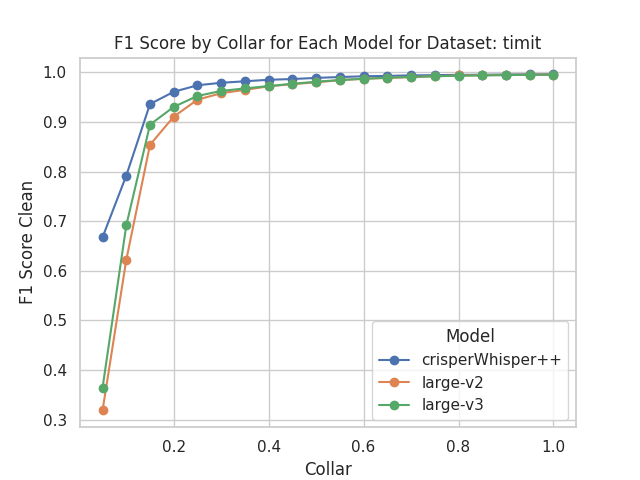

# CrisperWhisper++

**Whisper** is an ASR model [developed by OpenAI](https://github.com/openai/whisper), trained on a large dataset of diverse audio. Whilst it does produces highly accurate transcriptions they do follow more of a intended style possibly omitting false starts and fillers. Further timestamps are inaccurate especially around pauses and speech disfluencies.

This repository provides a extension of Whisper for fast automatic and verbatim speech recognition with accurate word-level timestamps. We call our variant CrisperWhisper++.  We make the following improvements to Whisper:

- 🎯 **Accurate word-level timestamps** even around disfluencies and pauses using an adjusted tokenizer and training with a custom attention loss.
- 📝 **Accurate verbatim transcription** In contrast to Whisper which follows more of a intended transcription style CrisperWhisper++ aims at transcribing every spoken word precisely
- 🔍 **Filler detection** Fillers like "um" and "uh" are canonically transcribed and detected with high accuracy
- 🛡️ **Hallucination mitigation** minimize hallucinations

### Performance Overview

One can see the superior performance of CrisperWhisper++ compared to the baseline variant when measuring F1 and Avg IOU as defined in our Paper on three different Datasets.

| Dataset                          | Metric     | CrisperWhisper++ | Large-v2 | Large-v3 |
|----------------------------------|------------|------------------|----------|----------|
| ami_hf                           | F1 Score   | 0.902851         | 0.853282 | 0.858086 |
|                                  | Avg IOU    | 0.858781         | 0.737205 | 0.770676 |
| cv_14                            | F1 Score   | 0.818483         | 0.513088 | 0.601556 |
|                                  | Avg IOU    | 0.818569         | 0.741766 | 0.764548 |
| timit                            | F1 Score   | 0.798538         | 0.670307 | 0.724891 |
|                                  | Avg IOU    | 0.834713         | 0.744916 | 0.785411 |


 One can clearly see the superiority of CrisperWhisper++ vs. the baseline.
 Varying the collars on the [TIMIT](https://catalog.ldc.upenn.edu/LDC93S1) Dataset confirms that timestamps are improved quite significantly.



This difference is much more pronounced in scenarios surrounding disfluencies. More plots and ablations can be found in the `run_experiments/plots` folder.


<h2 align="left", id="highlights">New🚨</h2>

- 1st place at [OpenASR Leaderboard](https://huggingface.co/spaces/hf-audio/open_asr_leaderboard) in verbatim Datasets (ted, ami) 🏆
- _CrisperWhisper_ accepted at INTERSPEECH 2024
- Paper drop🎓👨‍🏫! Please see our [ArxiV preprint](.....) regarding the details of adjusting the tokenizer and training.
- Additonally added a AttentionLoss to further improve timestamp accuracy


<h2 align="left" id="setup">Setup ⚙️</h2>
Tested for PyTorch 2.0, Python 3.10

GPU execution requires the NVIDIA libraries cuBLAS 11.x and cuDNN 8.x to be installed on the system.

### 1. Create Python3.10 environment

`conda create --name crisperWhisper++ python=3.10`

`conda activate crisperWhisper++`

### 2. clone this repo

```
$ git clone https://github.com/myReha/crisperWhisper.git
$ cd crisperWhisper
```

### 3. Install dependencies

`pip install -r requirements.txt`

You may also need to install ffmpeg, rust etc. Follow openAI instructions here https://github.com/openai/whisper#setup.


## 4. Python usage  🐍

```python
import os
import sys
import torch
from transformers import AutoModelForSpeechSeq2Seq, AutoProcessor, pipeline
from datasets import load_dataset


device = "cuda:0" if torch.cuda.is_available() else "cpu"
torch_dtype = torch.float16 if torch.cuda.is_available() else torch.float32

model_id = "/home/azureuser/laurin/code/research/output/crisper_whisper_timestamp_finetuned"

model = AutoModelForSpeechSeq2Seq.from_pretrained(
    model_id, torch_dtype=torch_dtype, low_cpu_mem_usage=True, use_safetensors=True
)
model.to(device)

processor = AutoProcessor.from_pretrained(model_id)

pipe = pipeline(
    "automatic-speech-recognition",
    model=model,
    tokenizer=processor.tokenizer,
    feature_extractor=processor.feature_extractor,
    max_new_tokens=800,
    chunk_length_s=30,
    batch_size=16,
    return_timestamps=True,
    torch_dtype=torch_dtype,
    device=device,
)

dataset = load_dataset("distil-whisper/librispeech_long", "clean", split="validation")
sample = dataset[0]["audio"]
result = pipe(sample, return_timestamps="word")
print(result)
```

## 5. Running the Streamlit App

To use the CrisperWhisper++ model with a user-friendly interface, you can run the provided Streamlit app. This app allows you to record or upload audio files for transcription and view the results with accurate word-level timestamps.

### Prerequisites

Make sure you have followed the [Setup ⚙️](#setup) instructions above and have the `crisperWhisper++` environment activated.

### Steps to Run the Streamlit App

1. **Activate the Conda Environment**

    Ensure you are in the `crisperWhisper++` environment:
    ```sh
    conda activate crisperWhisper++
    ```

2. **Navigate to the App Directory**

    Change directory to where the `app.py` script is located:


3. **Run the Streamlit App**

    Use the following command to run the app. Make sure to replace `/path/to/your/model` with the actual path to your CrisperWhisper++ model directory:
    ```sh
    streamlit run app.py -- --model_id /path/to/your/model
    ```

    For example:
    ```sh
    streamlit run app.py -- --model_id /home/azureuser/laurin/code/research/output/crisper_whisper++
    ```

4. **Access the App**

    After running the command, the Streamlit server will start, and you can access the app in your web browser at:
    ```
    http://localhost:8501
    ```

### Features of the App

- **Record Audio**: Record audio directly using your microphone.
- **Upload Audio**: Upload audio files in formats like WAV, MP3, or OGG.
- **Transcription**: Get accurate verbatim transcriptions including fillers
- **Video Generation**: View the transcription with timestamps alongside a video with a black background.
